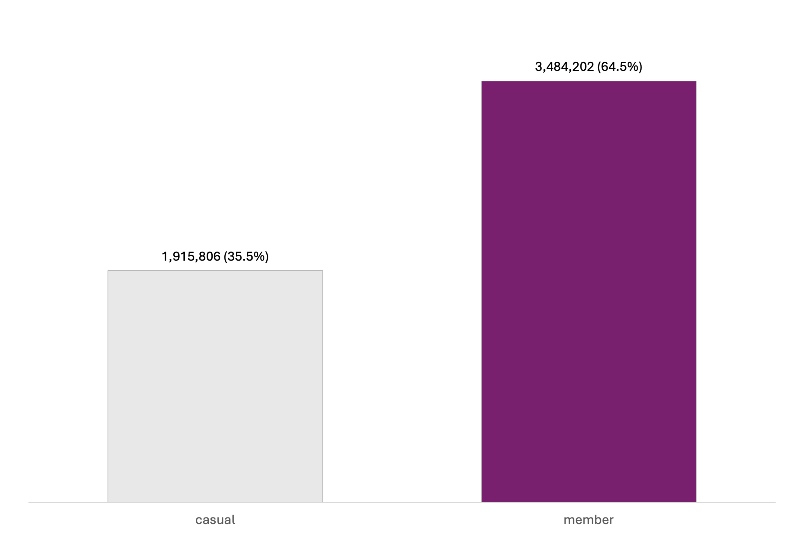
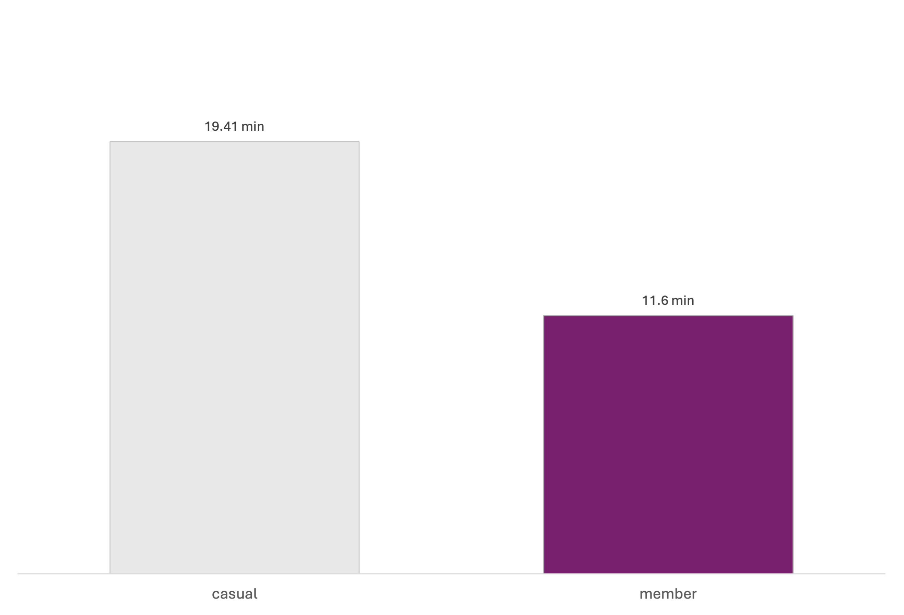
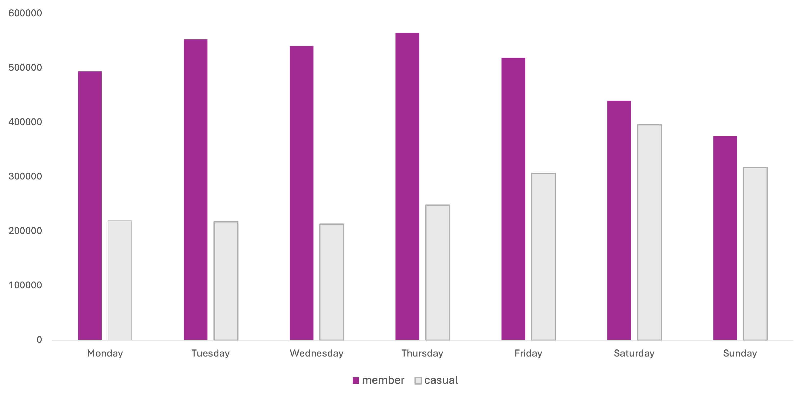
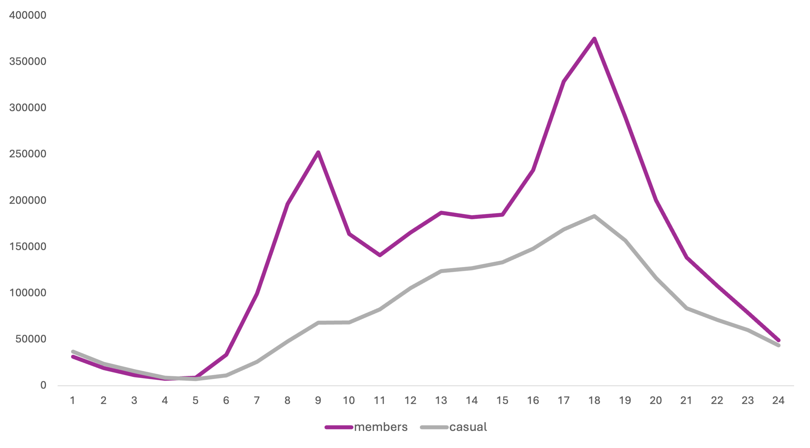

# Cyclistic Behaviour Analysis  
## Converting Casual Riders to Annual Members
#### 📊 Project Presentation
[View Full Presentation Slides](presentation/Presentation.pptx)

---
### Project Overview
This project analyses historical ride data from Cyclistic, a bike-share company, to identify behavioural differences between annual members and casual riders. The objective is to generate data-driven recommendations to increase annual membership conversions.

### Business Problem
Cyclistic aims to increase long-term revenue by converting casual riders into annual members.

**Key Question:**
How do annual members and casual riders differ in their riding behaviour?

### Tools Used:
- Google BigQuery (SQL)
- Microsoft Excel
- Microsoft PowerPoint

## Data Preparation
The dataset consisted of monthly ride data tables.

### Key preparation steps included:
- Combining monthly tables into a unified dataset
- Removing null and invalid records
- Filtering negative ride durations
- Creating calculated fields:
  - ride_length
  - day_of_week
  - hour_of_day
  - month
- Removing extreme outliers

All transformations were performed using SQL in BigQuery.

## Exploratory Data Analysis
### Total Ride Distribution
Annual members account for approximately 64.5% of total rides, forming the core usage base.

---
### Average Ride Duration
Casual riders take longer trips on average (19.4 minutes vs 11.6 minutes), suggesting leisure-oriented behaviour.

---
### Day-of-Week Patterns
Members exhibit strong weekday usage patterns, while casual riders show increased weekend activity.

---
### Hour-of-Day Behaviour
Members display clear peaks during commuting hours (around 8AM and 5–6PM).
Casual rider activity is more evenly distributed throughout the day.

### Rideable Type Preference
Rideable type distribution is nearly identical across both groups.

### Seasonality
Both groups follow similar seasonal trends, indicating seasonality does not explain behavioural differences.

---
## Key Insights
- Members primarily use the service for weekday commuting.
- Casual riders demonstrate stronger weekend and leisure usage.
- Behavioural differences are driven by ride timing, day-of-week patterns, and frequency.
- Rideable type preference and seasonality are not significant differentiators.

### Recommendations
1. Target frequent weekend casual riders with conversion incentives.
2. Position membership as a cost-effective commuting solution.
3. Implement behaviour-based targeting using ride timing and frequency data.

### Limitations
- No demographic or income variables available.
- No revenue or profitability data included.
- Observational analysis only — no causal testing done.

## Future Improvements
- Incorporate pricing and revenue data to estimate ROI.
- Conduct A/B testing on conversion campaigns.
- Build a predictive model to identify high-probability converters.

---
## Author
Mark Timlin  
Aspiring Data Analyst | SQL | Behavioural Analytics
